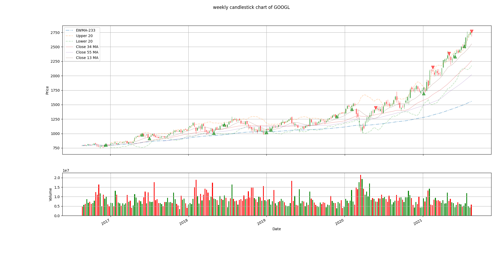
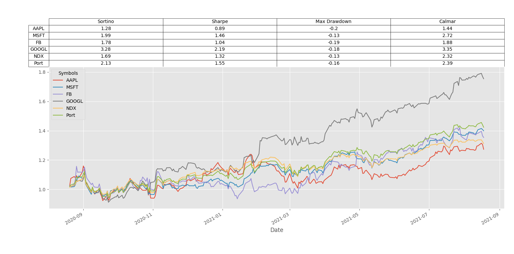

# Python-Financial-Analysis-Algorithmic-Trading
Data Visualization - using python with pandas and matplotlib libraries to read and display stocks data such as candle stick, volume display, EMA, SMA, Bollinger (upper &amp; lower) and also portfolio optimization

# ChartVisualization:
The user need to enter a stock symbol.
The program will ask the user where where he/she wish to save the excel file,
Then user will need to select timeframe (daily/ weekly/ monthly).
For example here is the output for "GOOGL" symbol and weekly timeframe:

Also the program print more information about the stock such as PE Ratio, Average Volume, Market Cap and more on the terminal

# ProtfolioOpt:
The user will need to enter number of stocks he/she want to have on the protfolio and then to enter the symbols of the stocks.
After that the program will caculate the Sharpe, Sortino and Calmar Ratios and also the Max Drawndown.
The program will display protfolio case of 1 dollar investing from the last year until today

